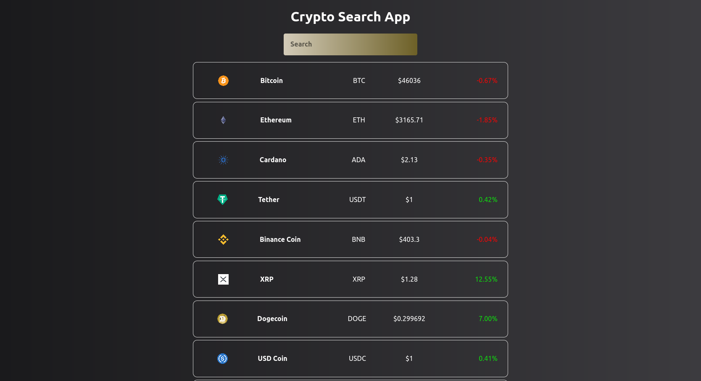

# Crypto Currency Search App - ReactJS

See live: [https://kripto-para-fuloskop.netlify.app](https://kripto-para-fuloskop.netlify.app)



## Usage

In the project directory, you can run:
```
yarn start
```


## Features

* Crypto currency search
* Price, price change and symbol info

## Tools

* JavaScript
* ReactJS
* CSS
* CoinGecko API
* Axios
